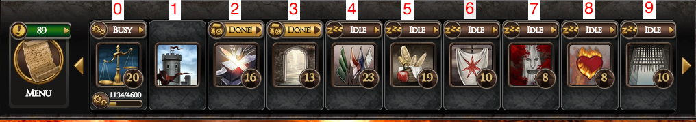
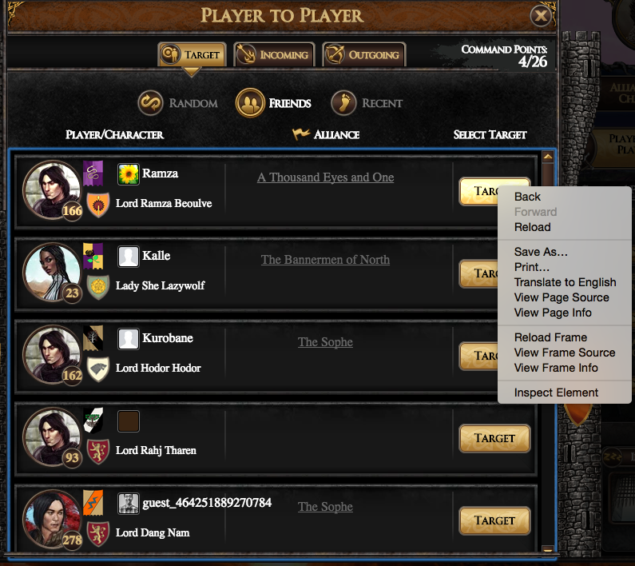
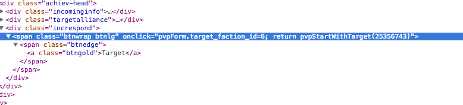
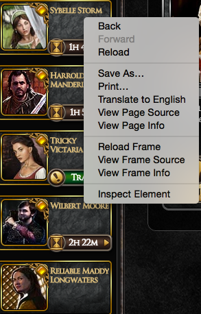

# GotABot Manual

## Build 
* Để build item cần thứ tự building và thứ tự item trong building 
đó
* Để biết thứ tự building:

* Để biết thứ tự item:

* Ví dụ để  shortsword
    * Building: smithy thứ tự là 2
    * Item: shortsword thứ tự 1
    * thêm [2, 1] vào biến items 

## Barter
* Để barter cần xác định:
    * Target id
    * SS id
    
* Target id
    * Chuột phải vào nút Target => Inspect Element
    
    * Tìm `pvpStartWithTarget` ở dưới Elements console của Chrome
    
    * 25356743 sẽ là target id
    * Thay target id vào biến `target` trong `barterInterval`
    
* SS id
    * Tương tự click vào mặt SS rồi Inspect Element
    
    * Tìm `item_min_268700767`
    * 268700767 là SS id
    * Thêm SS id vào biến `ssItems = [];`
    * Vd: ssItems = [268700767, 268700768];